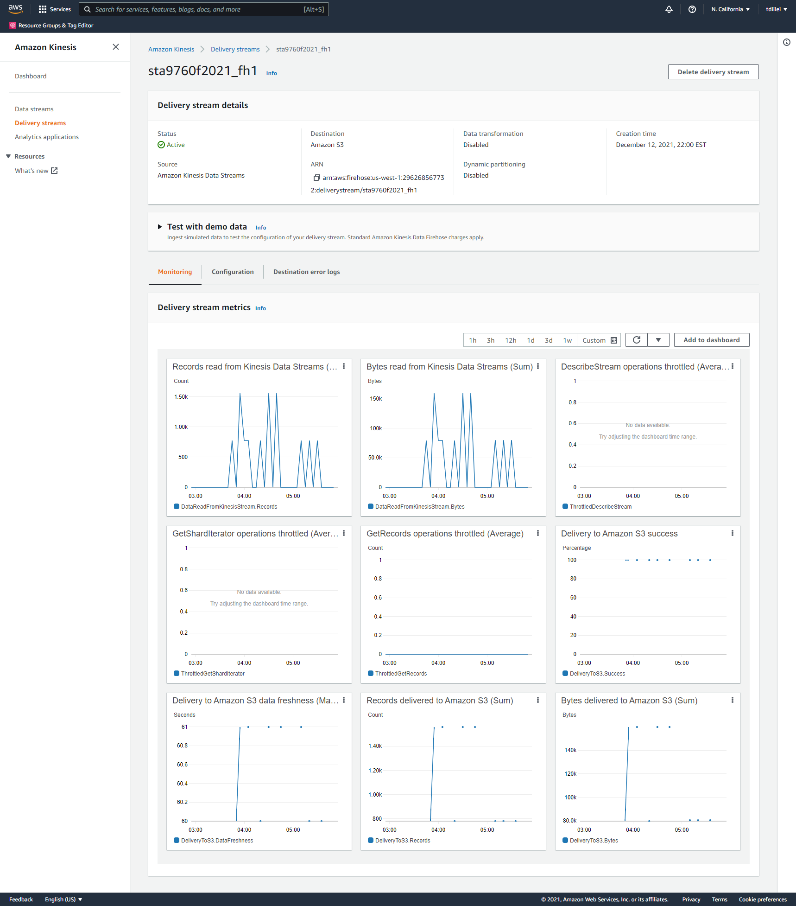

# Streaming Finance Data with AWS Lambda
For this project, I am provisioning a Lambda function to grab following tickers data records on 11/30/2021 for interactive querying:

Facebook (FB)

Shopify (SHOP)

Beyond Meat (BYND)

Netflix (NFLX)

Pinterest (PINS)

Square (SQ)

The Trade Desk (TTD)

Okta (OKTA)

Snap (SNAP)

Datadog (DDOG)

### DataTransformation & DataCollector
I created a Lambda function with the code called [data_transformer.py](https://github.com/tdlilei/Project03/blob/main/data_transformer.py) to gather data.The code is using [yfinance module](https://pypi.org/project/yfinance/) for collecting one full day's worth stock HIGH and LOW prices for each company listed above on November30th 2021, at a five minutes interval, then transforming the data into a JSON format. After that,the reocord placed into the kinesis stream and eventually stremed into S3 bucket.

### DataAnalyzer
I have congigured AWS Glue Crawler pointed it to the S3 bucket connected to the kinesis firehose,which I generated the data from lambda function, the Glue Crawer determines the classifier for the teicker dataset, and then generates metadata tables defining data schema in the Glue Data Catalog.Then I used [AWS Athena](https://github.com/tdlilei/Project03/blob/main/query.sql) interactively query underlying dataset to generate a [csv file](https://github.com/tdlilei/Project03/blob/main/results.csv) that contains the highest hourly stock 'high' per company listed above.

### [Analysis](https://github.com/tdlilei/Project03/blob/main/Analysis.ipynb)
Two visualizatios of the AWS Athena query output by Jupyter notebook.

### Infrastructure
Kinesis Data Firehose Delivery Stream Monitoring 

